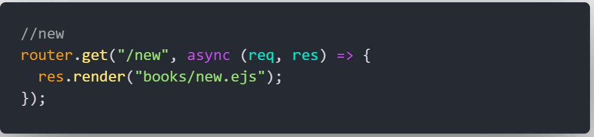

# <a href="https://bookstore-11d515fc5289.herokuapp.com/"> BookSpot </a>
### description

The website will give you option if sign in and sign up , only the registered users will be able to see the library and add their books , The main idea of the website is to let the user list there published books and advertise them into the website so that might have a potential buyers from this website . 

# ERD & Data Entity Fields
> [!IMPORTANT]
> This diagram shows the structure of a database, which is a special type of computer file used to store and organize information. In this case, the database is designed to keep track of books and the people who own them.
> 

# User Stories
- As a new user, I want to easily create a new account, so I can access personalized features and services on the platform.
- As a registered user, I want to log in to my account, so I can access my personal data and interact with the platform's features.
- As a logged-in user, I want the ability to log out of my account, to ensure its secure when I'm not using the platform.
- As a user, I want to list the books that I have published, to advertise them to potential buyers.
- As a user, I want to view all the books created by every user on a single page, to explore available books. 
- As a user interested in a book, I want to have a link to get the book 
- As a user who owns a book, I want the option to delete something I created, in case the book is no longer available.
- As a user who owns a published book, I want to edit details of my book, to ensure the information stays up to date. 

# Pseudo code

- build a landing page let the user see the sign in and sign up page - 
-  if the user is registered he can see the book list and make a new one
- the owner of the book can edit the book details 
- the owner of the book cann delete the book
- the user can't  delete or modify other books

# Technologies Used: 
#### Technologies used for this project : HTML , CSS , JavaScript and EJS

# MarkUp

# OverView
- landing page for non registered user

- landing page for registered user

- sign in page 

- sign-up page 

- index page 

- add new book

# Routes Used
- index route 

- new route 

- create Route 

- show route 

- edit and update Route 

- delete Route 

# Future Work 
-  links to purchase the book virtualy 
-  reviews to books
-  the cover of the book